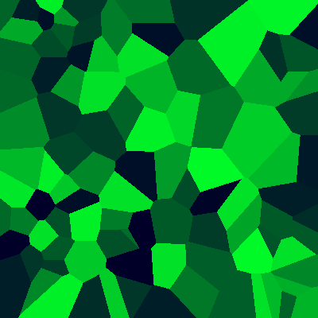

# sqlite creative coding

Generating some visuals with SQL because nobody stopped me. With the magic of [recursive CTE](https://sqlite.org/lang_with.html).

### Dependencies
- sqlite3
- imagemagick

### Setup
- Using justfile: `just setup`
- Directly: `sqlite3 fun.db < setup.sql`

### Generate image
- Using justfile: `just image src/mandelbrot.sql`
- Directly: `sqlite3 fun.db < src/mandelbrot.sql && ./image.sh mandelbrot fun.db`

<table>
  <tr>
    <td width="50%" valign="top">
      <h3><a href="./src/gradient.sql">Gradient</a></h3>
      
    </td>
    <td width="50%" valign="top">
      <h3><a href="./src/mandelbrot.sql">Mandelbrot fractal</a></h3>
      
    </td>
  </tr>
  <tr>
    <td width="50%" valign="top">
      <h3><a href="./src/polka.sql">Just some dots</a></h3>
      
    </td>
    <td width="50%" valign="top">
      <h3><a href="./src/voronoi.sql">Voronoi</a></h3>
      
    </td>
  </tr>
</table>

